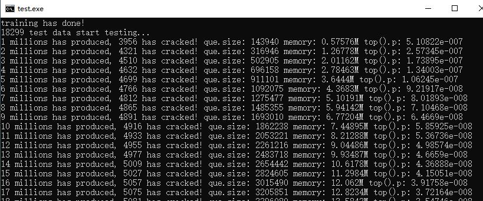

## PCFG介绍

是一种基于经典统计学的口令猜测算法，论文中描述其性能比使用默认规则集的John the Ripper能多破解的密码。

## PCFG算法思想

的过程大概是：

1、每种密码可以使用的方式表示，例如，可以表示为

2、根据训练集统计每个密码不同部分出现的频率：

&=P(L_3S_2D_3)*P(hel)*P(\$\$)*P(666);\end{aligned})

3、对于测试集合，得到对应的密码格式($$LDS$$)，使用优先队列存储当前猜测的密码，每次取出概率最高的密码，然后判断是否猜中，如果没有猜中进行转移。

## PCFG的具体实现

1、运行split_train_test.cpp根据myspace.txt字典文件，首先清洗掉带有不可见的字符的密码，然后随机生成训练集myspace_train.txt和测试集myspace_test.txt

2、运行train_and_test.cpp，对myspace_train.txt进行训练，然后对myspace_test.txt进行测试，同时将破解的进度每隔1000个输出到文件XY.txt中

3、运行draw.py对XY.txt进行绘图

## 实现中的问题和缺点

1、因为电脑性能的原因，这里只生成了10Millions的guesses。

2、不知道是不是字典的问题，我使用的myspace.txt中的密码只有37144，论文中的是67042个，去除字典中的一些不可见字符，最终使用的36874个密码。

